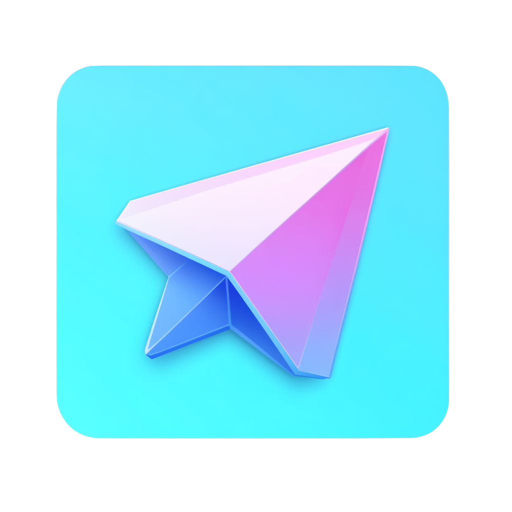

## Welcome to upTon! 

### What’s upTon?

Catch UpTon!

UpTon is a Telegram mini app that takes token launches to the next level, focusing on **community**, fun, and of course, **stickers**! Built on the TON ecosystem, upTon gives you the tools to quickly create a vibrant community around your new token while adding some flair with custom Telegram stickers.

Be a **meme leader** with no burden. Launching a token on upTon is as easy as sending a message on Telegram. We make sure your community gets built, and everyone can join in the fun.

### Feature

At upTon, community is king. The people holding the most tokens are seen as the largest contributors to the project, playing a pivotal role in shaping the direction and growth of the community. As your stake in the token grows, so does your influence.

1. **Token-Based Influence**: Top5 holders can access to Telegram settings of the community group. (Access changed on a daily basis.)
2. **Self-Governance**: The community is fluid, decentralized, and leadership shifts naturally with token distribution.
3. **Viral Stikcers**: Stikcers spread virally. Each token comes with a custom sticker in telegram. As community shares and sends stickers in chats, it naturally promotes your token.
4. **People Can Come and Go**: Influence changes as people buy or sell tokens, keeping the community dynamic and evolving.
5. **Fair Token Incentive**: Fair launch for all and the tokens are the natural incentive for people to contribute and be active.

   
### How It Works

1. **Pick a Token**: Pick a cool token from upTon’s list
2. **Buy Token**: Purchase your token directly. Prices go up as more people buy in—so get in early.
3. **Join Community**: Join in the community and get **funked up** with the stikers. Enjoy chatting and sharing.
4. **Sell Anytime**: Want to cash in? No worries. You can sell your tokens anytime, locking in those sweet gains (or taking a small loss—hey, it happens!).
5. **Charging Phase**: When the token's market cap hits a legendary $40k, it's time for the next phase.
6. **Boom Phase - Liquidity Added**: Boom! $10k liquidity is locked into STON and burned.🔒🔥

### How to Start a New MemeCoin on upTon

All you need: a name, a ticker, and a meme. Description? Totally optional. 😎

Don't stress about the details—upTon’s got your back. We’ll automatically set up your community link and create custom stickers for you. It’s as easy as launching a new group chat!

- **Instant Community Creation**: Forget setting up groups manually! upTon does it for you, preparing a link ready to share right when your token is launched.
- **Custom Stickers**: Each token gets its own sticker that users can send to their friends, promoting your token in a fun and viral way.
- **Effortless Sharing**: Share your token easily within Telegram chats. upTon makes it simple for your community to invite others and spread the word.
- **Pinned Messages**: Automatically pin key announcements or milestones in your Telegram group to keep your members updated and excited.
- **Token Leader Changes**: Automatically assign access to community settings to top 5 largest token holders of the day.

#### YO, UPTON FUNK YOU UP 

#### Features

* Pump list
   * PUMP IT [add liquidity] 
       * three optionals button or pay as you want
   * Progress Bar & Total Raised
* Create a Pump
   * Name 
   * Description [Optional]
   * Symbot [Ticket]
   * Sticker [Optional]
   * Community [Optional, link]
   * PUMP It

